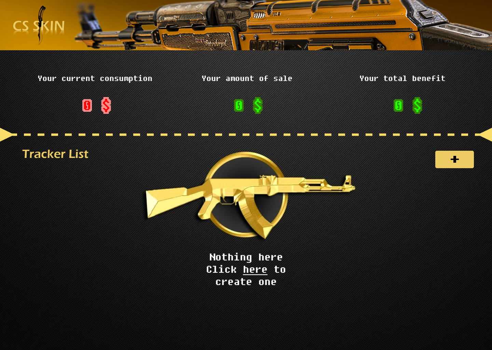
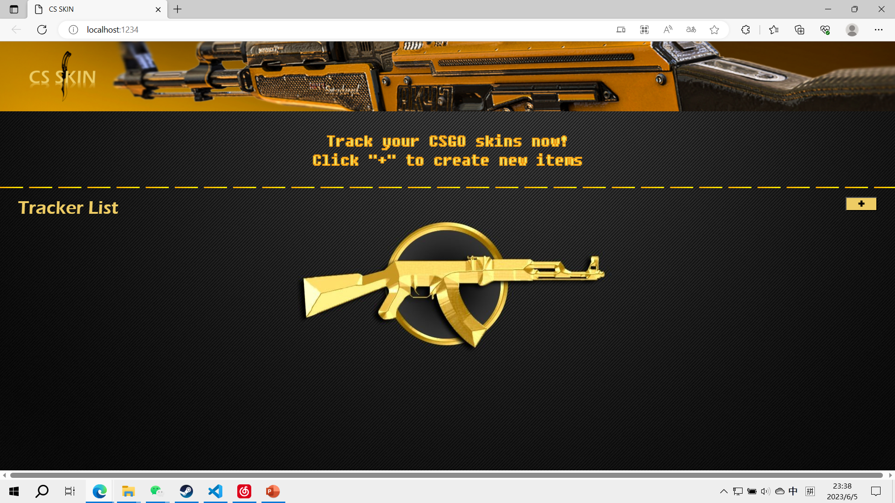
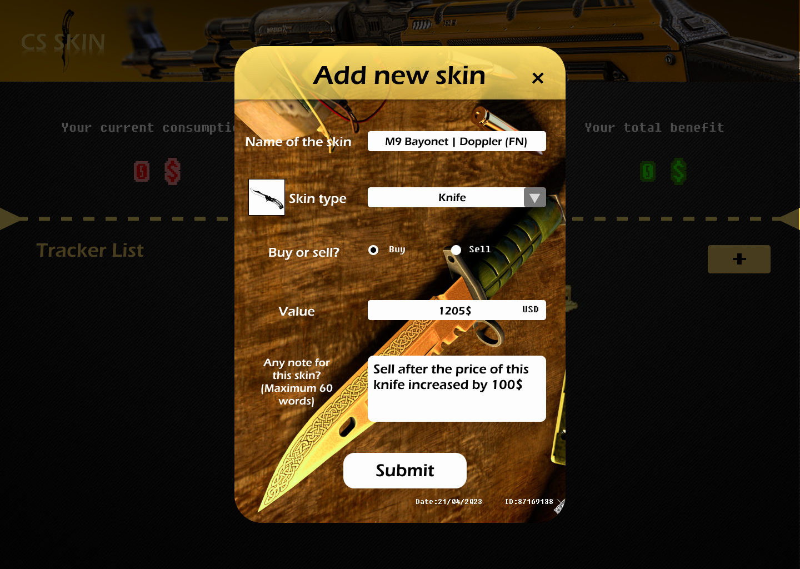
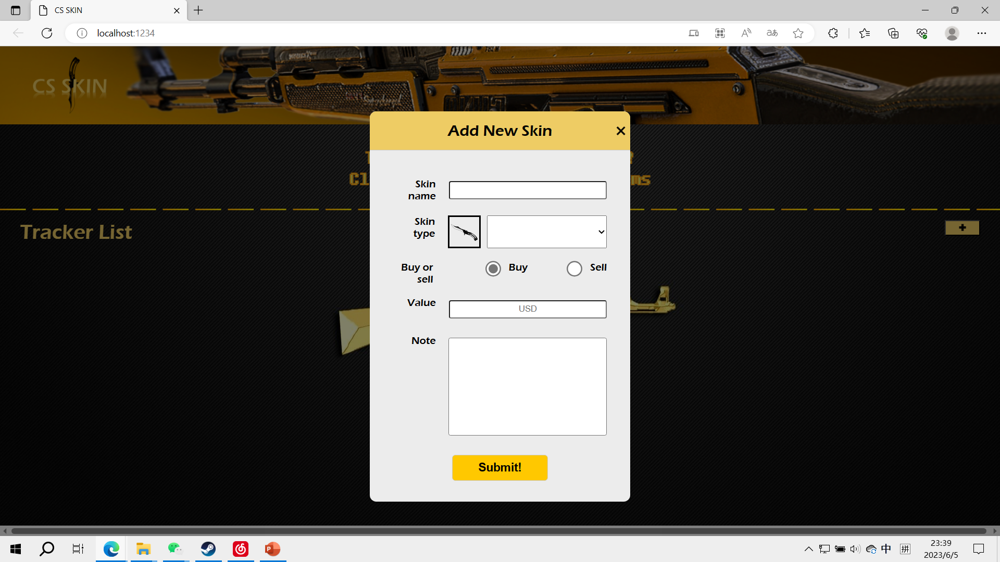
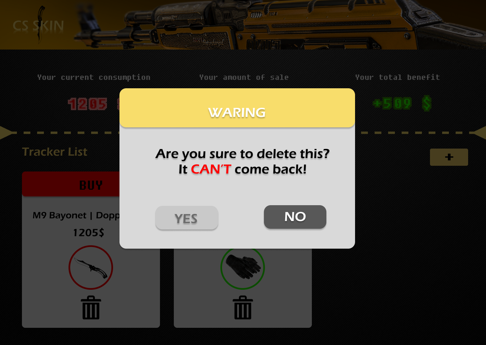
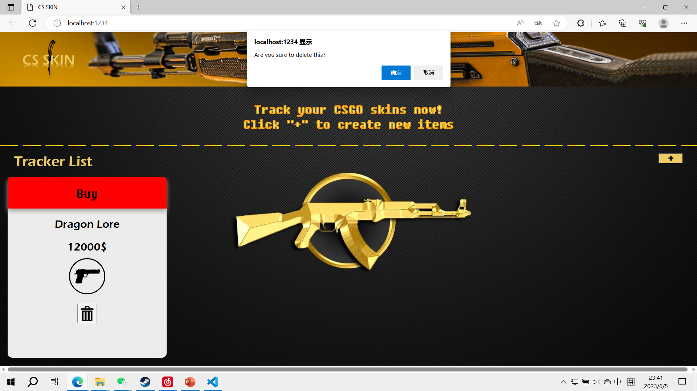

# CSGO Skin tracker

 ## Web application funtion
 This web application aim to help user track their CSGO skin consumption status, let user have a better view of the information that related to the skin they bought or sold.
 
 ## Devlopment log:

 ## Iteration from the initial design

 
 (above:web design ; below:prototype)
 

 In the initial web design, I want to add a function to calculate the profit and loss of the user's total skin purchase.But at tutor's suggestion, I scrapped this block feature because it was too complicated for my current capabilities. I then ended up replacing the block with a header text that guides the user through the actions.
 
   

 
 (above:web design ; below:prototype)
 

 Based on tutor's suggestion, I removed the complex background image and replaced it with the same gray background as the item card in order to keep the user's attention from being drawn to other things while entering information

   

 
 (above:web design ; below:prototype)
 
 

 ## Iteration 1 Date:1/6/2023

- Create and arrange HTML structure, including header, division, card area and other sections
- Added basic CSS styles such as gridlayout,position and decorations to the page.
- Set the basic node server and parcel for easier development.

## Iteration 2 Date:2/6/2023
- Implemented a pop-up window with a overlay for input form using html and JavaScript functions.
- Set the form with inputs according to the data model
- Set the CSS style for the input form.
- Try hosting a page with github to see the results.

## Iteration 3 Date:3/6/2023
- Implemented JavaScript functionality to handle form submission, item card creation.
- Set CSS style for item cards
- Add delete function to the item cards by JavaScript.

## Iteration 4 Date:4/6/2023
- Added event listeners to display detailed information in a popup (info card) when a card header is clicked.
- Set CSS Style for info card.
- Try hosting a page with github to see the results.
- Set the responsive design for different screen size by CSS

## Iteration 5 Date:5/6/2023
- To add local storage functionality, I overhauled the previous JavaScript code. 
- Create functions for saving card data to and loading data from local storage.(old version: generate the card directly by event listener)
- Modify form submission logic to save card data to local storage
- Implement local storage function to save and load card data
- Update the rendering logic to load card data from local storage and display it on page load.
- Using github to host the site and tested the running effect with computer and cell phone separately.
- Add comment to the code.

## Configuration:

- No specific configuration is needed, just need electronic devices that can run browsers. 
- This application uses HTML, CSS and JavaScript. which almost all modern browsers can load this application.

## Deployment:
- The web application can be deployed by hosting via github.
- The web application can be deployed through localhost.